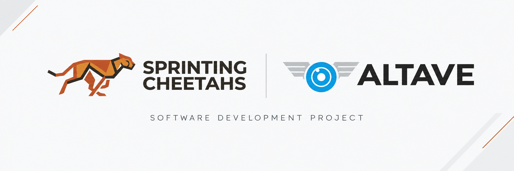

# 
 Sistema de Ordens de Serviço da Altave 

### 
 Equipe Sprinting Cheetahs 

  <a href="#apresentacao">Apresentação</a> | 
  <a href="#desafio">Desafio</a> | 
  <a href="#objetivo">Objetivo</a> |
  <a href="#tecnologias">Tecnologias</a> |
  <a href="#epicos">Épicos</a> |
  <a href="#backlog">Backlog</a> | 
  <a href="#metodologia">Metodologia</a> |
  <a href="#dor">DoR</a> | 
  <a href="#dod">DoD</a> | 
  <a href="#equipe">Equipe</a>

> **Status do Projeto:** Em andamento ⏱️

---

## 📌 Apresentação 

  O <strong>Sistema de Ordens de Serviço</strong> é um projeto acadêmico desenvolvido por alunos do segundo semestre de Desenvolvimento de Software Multiplataforma da FATEC Prof. Jessen Vidal, com a finalidade de colocar em prática os conhecimentos adquiridos ao longo do curso.

### 🔎 Desafio 

  O software foi desenvolvido a partir da necessidade de facilitar a comunicação entre equipes e o gerenciamento de novas Ordens de Serviço (OS) da empresa <strong><a href="https://altave.com.br/home/">ALTAVE</a></strong>. Sendo assim, a proposta principal do sistema é a gestão do processo de novos produtos e pedidos de manutenção, além de proporcionar maior clareza sobre as etapas de andamento das atividades aos funcionários.

---

## 🎯 Objetivo do Projeto 

  O projeto foi desenvolvido em parceria com a <strong>ALTAVE</strong>, empresa especializada em soluções completas de monitoramento que integram software, hardware e inteligência artificial, com o objetivo de desenvolver um <strong>sistema de gerenciamento de ordens de serviço</strong> voltado à organização e otimização dos processos internos da empresa. A solução possui <strong>hierarquia de permissões de acesso</strong>, divisão por setores, comunicação entre equipes e recursos para <strong>registro, acompanhamento e detalhamento das ordens de serviço</strong>, permitindo a inclusão de informações, descrições, análises e atualizações relacionadas a cada atendimento, proporcionando maior controle, organização e rastreabilidade sobre os serviços realizados.

---

## 👨🏻‍💻 Tecnologias Utilizadas 

  
  
  
  
  
  
  
  
  
  

---

## 🏷️ Épicos 

- <strong>E1: </strong>Cadastro, autenticação e gestão de usuários
- <strong>E2: </strong>Solicitação de Ordem de Serviço (OS)
- <strong>E3: </strong>Etapa de produção
- <strong>E4: </strong>Fluxo de estado da OS
- <strong>E5: </strong>Notificações
- <strong>E6: </strong>Histórico de OS e rastreabilidade

---

## 📋 Backlog 

| RANK | USER STORY | PRIORIDADE | ESTIMATIVA | ÉPICO | SPRINT |
| :---: | :--- | :---: | :---: | :---: | :---: |
| 1 | Como gestor, quero cadastrar times (equipes técnicas), para que eu possa atribuir OS a eles | Should | 5 | E1 | 1 |
| 2★ | Como gestor, quero cadastrar usuários e vincular cada um a um time, para que cada pessoa tenha acesso ao que é relevante para sua função | Must | 5 | E1 | 1 |
| 3 | Como gestor, quero definir o papel de cada usuário, para que cada um veja só o que é relevante para sua função | Should | 3 | E1 | 1 |
| 4 | Como usuário do sistema, quero fazer login com minhas credenciais, para que eu acesse apenas as funcionalidades do meu time | Should | 8 | E1 | 1 |
| 5★ | Como equipe comercial, quero abrir uma solicitação de novo produto/pedido, para que o gestor possa designar a equipe técnica responsável pelo desenvolvimento | Must | 5 | E2 | 1 |
| 6★ | Como suporte, quero abrir uma solicitação de manutenção/acidente para relatar um problema, para que uma equipe seja solicitada para resolver o problema | Must | 3 | E2 | 1 |
| 7 | Como equipe comercial ou suporte, quero que o sistema exija o preenchimento dos campos obrigatórios ao abrir uma OS, para que nenhuma OS seja criada sem as informações mínimas necessárias | Should | 1 | E2 | 1 |
| 8 | Como equipe de implantação, quero anexar laudos em PDF à OS, para que a documentação do atendimento fique registrada junto ao histórico | Could | 8 | E6 | 1 |
| 9 | Como gestor, quero atribuir uma OS a um time específico, para que a equipe correta seja responsável pela execução | Must | 3 | E3 | 2 |
| 10 | Como gestor, quero definir a prioridade de uma OS (urgência/criticidade), para que os casos mais críticos sejam tratados primeiro | Should | 3 | E3 | 2 |
| 11 | Como equipe de produção, quero visualizar as OS atribuídas a mim (tanto de novo produto quanto de manutenção), para que eu saiba o que preciso montar ou configurar | Should | 5 | E3 | 2 |
| 12 | Como equipe de produção, quero marcar uma OS como "montagem/configuração concluída", para que ela siga automaticamente para a Equipe de Implantação | Must | 2 | E3 | 2 |
| 13 | Como equipe técnica ou equipe de implantação, quero atualizar o status de uma OS, para que todos saibam em que ponto está o atendimento | Must | 1 | E4 | 2 |
| 14 | Como gestor, quero um painel com visão geral das OS por status/time/prioridade, para que eu tenha uma visão consolidada da operação | Could | 3 | E4 | 2 |
| 15 | Como gestor, quero visualizar em qual etapa cada OS está, para que eu tenha uma visão geral do andamento de todas as solicitações | Should | 2 | E4 | 2 |
| 16 | Como gestor, quero um filtro no qual apareçam as OS abertas ou em andamento por prioridade, mais recente ou prazo mais próximo | Could | 3 | E4 | 3 |
| 17 | Como gestor, quero ver quais OS estão atrasadas, para que eu possa agir antes que o atraso se torne um problema maior | Should | 8 | E4 | 3 |
| 18 | Como usuário, quero receber notificação quando houver mudança relevante na minha OS, para que eu me mantenha atualizado sem precisar checar o sistema o tempo todo | Should | 5 | E5 | 3 |
| 19 | Como equipe técnica, suporte ou gestor, quero ser notificado quando uma OS crítica for aberta, para que eu reaja rapidamente a casos urgentes | Should | 5 | E5 | 3 |
| 20 | Como usuário, quero ver o histórico completo de uma OS (status, responsáveis, prazos), para que eu tenha rastreabilidade e clareza sobre o que já ocorreu | Should | 5 | E6 | 3 |
| 21 | Como gestor, quero que o sistema guarde um registro de tudo que acontece nele, para que eu consiga checar depois quem fez o quê | Should | 13 | E6 | 3 |

---

## ⚙️ Metodologia 

  A <strong>filosofia ágil</strong>, especificamente o <strong>Scrum</strong>, foi utilizada como abordagem para o gerenciamento e desenvolvimento do projeto. O Scrum é baseado em ciclos iterativos e incrementais, promovendo colaboração constante, entregas frequentes e adaptação contínua às mudanças. O trabalho foi dividido em ciclos curtos chamados <strong>sprints</strong>, com duração de 3 semanas. Durante cada sprint, a equipe trabalhou de forma colaborativa para planejar, desenvolver, testar e entregar funcionalidades incrementais do sistema. O Scrum também estabeleceu papéis bem definidos entre os integrantes, como o <strong>Product Owner</strong>, responsável pela priorização das tarefas e alinhamento das necessidades do projeto; o <strong>Scrum Master</strong>, responsável por facilitar o processo e auxiliar na remoção de impedimentos; e a <strong>Equipe de Desenvolvimento</strong>, responsável pela implementação das funcionalidades. A metodologia promoveu transparência, comunicação constante e melhoria contínua, contribuindo para entregas mais organizadas e alinhadas às necessidades apresentadas pela empresa parceira.

---

## 🏃‍♂️ DoR - Definition of Ready 

- **Clareza:** Descrição clara e objetiva da funcionalidade e o que ela entrega
- **Critérios de aceitação:** Itens que definem quando a entrega funcionou
- **Prioridade e prazo:** Definição de data limite e importância da tarefa
- **Épico:** A qual épico a funcionalidade faz parte
- **Obstáculos:** Não há dúvidas ou impedimentos

---

## 🏆 DoD - Definition of Done 

- **Padronização:** O código segue os padrões de commit
- **Critérios de aceitação:** Os critérios de aceitação foram cumpridos
- **Jira:** A tarefa foi atualizada corretamente no Jira
- **Testagem:** A funcionalidade foi testada e aprovada
- **Aprovação do PO:** O teste funcional foi aprovado pelo PO
- **Documentação:** O arquivo README ou manuais técnicos foram atualizados
- **Bugs:** Sem erros críticos conhecidos

---

## Contribuição

O padrão de commits e a estratégia de branches pode ser visualizada em [GUIA.md](./docs/GUIA.md).

---

## 👤 Equipe 

| Foto | Função | Nome | GitHub | Linkedin |
| :--: | :----: | :--: | :----: | :----: |
|  | Product Owner | Daiane Karine da Silva |  |  |
|  | Scrum Master | Leonardo Vilela Matiusso |  |  |
|  | Dev Team | Arthur Óliver Rossi Alves |  |  |
|  | Dev Team | Lavínia Martins Moreno Sanches |  |  |
|  | Dev Team | Guilherme Henrique Campos Ribeiro |  |  |
|  | Dev Team | Gustavo de Oliveira Azevedo |  |  |
|  | Dev Team | Kelwin Felipe Rocha Silva |  |  |
|  | Dev Team | Vinicius de Souza |  |  |

<a href="#topo">↑ Voltar ao topo</a>

