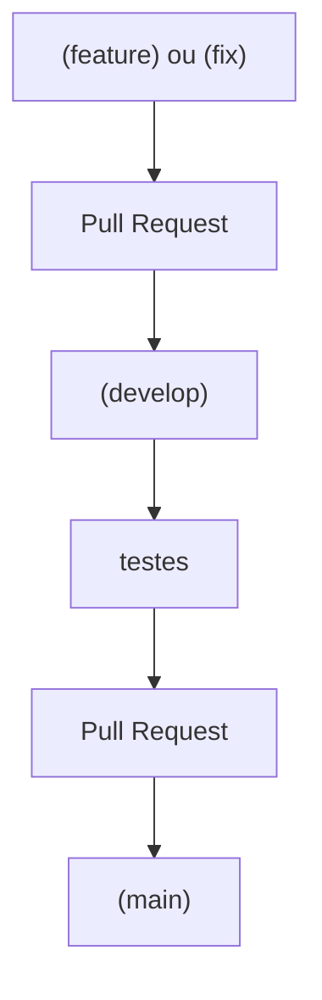

# Estratégia de branches

A estratégia foi escolhida por proporcionar maior organização ao desenvolvimento em equipe, permitindo que diferentes funcionalidades sejam desenvolvidas de forma independente. A separação das branches reduz o risco de alterações incompletas afetarem a versão estável do sistema e facilita o controle das modificações realizadas por cada integrante.

O uso de `Pull Requests` e revisão de código também contribui para a identificação de erros antes da integração das alterações, além de facilitar o acompanhamento do histórico do projeto. Dessa forma, a estratégia escolhida é adequada ao desenvolvimento colaborativo e ao controle das diferentes versões do sistema.

| Tipo de branch | Convenção de nome | Uso |
| --- | --- | --- |
| Produção | `main` | Único branch de produção/entrega. Nunca recebe commit direto — só recebe merge (pull) vindo da `develop`, já validada. |
| Integração/teste | `develop` | Branch de integração. Recebe as branches de funcionalidade/correção via Pull Request. Funciona como uma etapa de teste antes de ir para a `main`. |
| Funcionalidade | `feature/US<id>-descricao-curta` | Novas funcionalidades, associadas a uma User Story do backlog. |
| Correção | `fix/US<id>-descricao-curta` | Correções de bugs em uma User Story já entregue. |

`<id>` é o número da User Story do backlog (ex.: `US#04` vira `US04` na branch — sem o `#`).

> ⚠️ **Nota técnica:** o `#` é evitado no nome da branch — no terminal ele é interpretado como início de comentário (exigindo aspas em todo comando) e, em URLs do GitHub, é o caractere de âncora de página. Por isso a branch usa `US04`, não `US#04`.

**Exemplos:**

```bash
feature/US04-CriacaoConta
feature/US04-Login
```

> A identificação usada em branches e commits é sempre o número da **User Story** (ex.: `US#04` no backlog, `US04` na branch), presente no backlog público do projeto — nunca códigos internos de tarefa do Dev Team, que só fazem sentido para quem acompanha as reuniões do time.


**Exceção — mudança sem User Story associada ou branches experimentais/pessoais:**

Branches de experimentação, prova de conceito ou estudo (ex.: `test/react`) não seguem obrigatoriamente a convenção `feature/`/`fix/`, pois não têm como destino um merge direto na `develop`. Use o prefixo `test/` para deixar claro que a branch não deve ser mesclada sem antes ser reorganizada em uma `feature/` ou `fix/` correspondente.

---

## Fluxo de uma branch



1. Criar a branch a partir da `develop` atualizada.
2. Implementar a mudança (`feature/...` ou `fix/...`).
3. Abrir um Pull Request para a `develop`, com descrição do que foi implementado e como testar.
4. Obter pelo menos uma revisão de outro integrante antes do merge.
5. Fazer o merge na `develop`.
6. Deletar a branch após o merge.
7. Periodicamente (ou ao final de um ciclo/sprint), com a `develop` validada e testada, abrir um Pull Request de `develop` para `main`.
8. Fazer o merge na `main` — este é o único jeito da `main` receber atualizações.

---

## Regras gerais

- A `main` nunca recebe commit direto: só recebe merge vindo da `develop`, sempre via Pull Request revisado pelo time.
- A `develop` deve evitar commit direto: priorizar merge vindo de `feature/` ou `fix/`, sempre via Pull Request revisado por outra pessoa.
- Branch de trabalho (`feature/` ou `fix/`) deve nascer da `develop`, não da `main`.